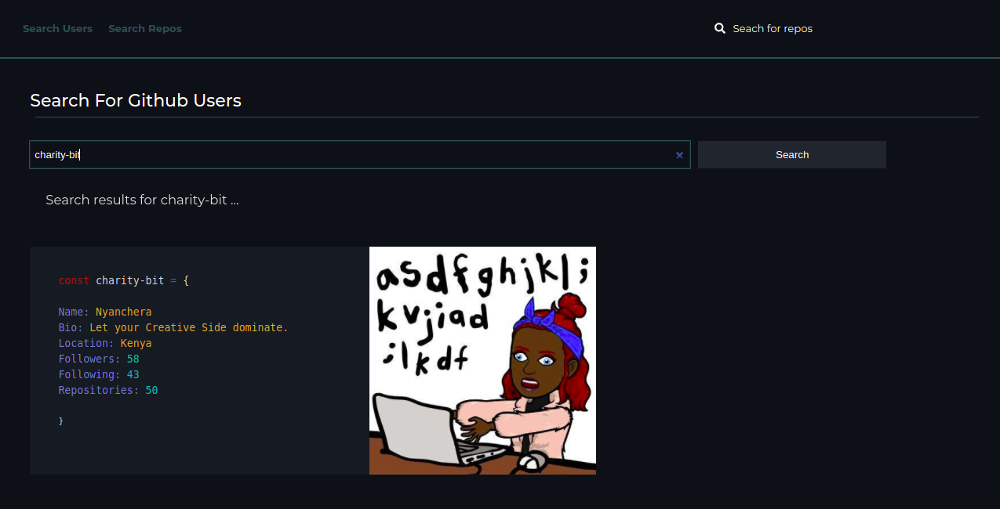

# GithubSearch

This is an Angular application that consumes githubSearch API to optimize searching for any github user, their repositories or just any repositorythat is in github.

By Charity Nyanchera

Click to view <a href="https://search-git-hub.netlify.app/">live Demo</a>

 

## Table of Content

- [Description](#description)
- [Installation Requirement](#Installation)
- [Technology Used](#technology-used)
- [Reference](#reference)
- [Licence](#licence)
- [Authors Info](#author-Info)
- [ToDO](#To-Do)

## Description

 This is an Angular application that consumes githubSearch API to optimize searching for any github user, their repositories or just any repositorythat is in github.

### Requirements

- Devices such as tablet , phones , laptops and desktop computers.

- Access to the internet.

### Installation Process

---

Click on the link below to view the live site

<a href="https://search-git-hub.netlify.app/">live site<a>

---

git clone - to clone this repo

## Technology Used

- ANGULAR

- CSS

- JAVASCRIPT

- TYPESCRIPT.

## Reference

- 
<a href="https://developer.mozilla.org/en-US/"> MDN Web Docs</a>

- 
<a href="https://angular.io/">Angular official documentation</a>

 

## Licence

  <a href=https://github.com/charity-bit/githubSearch/blob/main/LICENSE">MIT LICENSE</a>

 
 

 

 [Go Back to the top](#githubSearch)

## Authors Info

LinkedIn - [Charity Nyanchera](https://www.linkedin.com/in/charity-nyanchera-2679281a2/)

twitter - [Twitter](https://twitter.com/CcNyanchera)

[Go Back to the top](#githubSearch)
